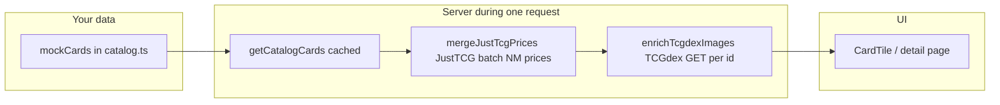

# Card catalog: how data flows (JustTCG + TCGdex + Next.js)

This document walks through **everything that happens** from a page request to the card tiles you see, so you can map each step to the code.

---

## 1. Where the “source of truth” starts

- **File:** `src/lib/catalog.ts`
- **What it is:** A static `mockCards` array. In v1 this is your stand-in for a future PostgreSQL `cards` / `listings` table.
- **Each row can declare:**
  - **`justtcgCardId`** — JustTCG’s stable card id (used only for **market price**).
  - **`tcgdexCardId`** — TCGdex’s card id, e.g. `svp-027`, `base1-4`, `sv03.5-193` (used only for **artwork**).

JustTCG does **not** ship card images in their API; TCGdex does. That is why this project uses **two services**: prices from one, images from the other.

---

## 2. Single entry: `getCatalogCards()`

- **File:** `src/data/catalog.ts`
- **What it does:** One async function the UI calls to get “display-ready” cards.
- **Important:** It is wrapped in React **`cache()`** from `react`. That means: during **one** server render (one HTTP request), every component that calls `getCatalogCards()` shares the **same** result and the **same** downstream API work is not duplicated.

Pipeline inside `getCatalogCards()`:

```text
mockCards  →  mergeJustTcgPrices()  →  enrichTcgdexImages()  →  CatalogCardWithPricing[]
```

---

## 3. Step A — JustTCG (market price, optional API key)

- **File:** `src/lib/justtcg/merge-catalog-prices.ts`
- **Runs on:** the server only (`import "server-only"`).

### Authentication

- **Env:** `JUSTTCG_API_KEY` in `.env.local` (see `.env.example`).
- **Client:** `justtcg-js` `JustTCG` class reads the key (or you pass `{ apiKey }`).

### What we send

- We collect every **unique** `justtcgCardId` from `mockCards`.
- For each chunk (max **20** ids per call — free-plan batch limit), we call:

  `client.v1.cards.getByBatch([{ cardId, condition: ["Near Mint"] }, ...])`

  So we only ask for **Near Mint** variant rows, which keeps payloads smaller and matches a typical “NM market” display.

### What we get back

- An array of **Card** objects, each with **`variants[]`**. Each variant has a **`price`** in **USD** (dollars, not cents).
- We pick the **minimum** price among **Near Mint** variants (if none, we fall back to all variants).

### How we merge into your catalog rows

- We build a `Map<justtcgCardId, priceInCents>`.
- For each `mockCards` row:
  - If there is **no** `justtcgCardId` → `priceSource: "mock"`, keep `marketPriceCents` from the mock.
  - If there **is** an id but the API did not return a price → same as mock, `priceSource: "mock"`.
  - If the API returned a price → overwrite `marketPriceCents` and set `priceSource: "justtcg"`.

### Failure behavior

- Missing key, thrown errors, or `response.error` from the API → **every** card gets `priceSource: "mock"` and the mock prices stay visible. The site keeps working.

### What we set for images here

- **`imageUrl: null`** — images are filled in the next step, not by JustTCG.

---

## 4. Step B — TCGdex (card images, no API key)

- **File:** `src/lib/tcgdex/enrich-images.ts`
- **Runs on:** the server only.

### Endpoint

For each `tcgdexCardId`:

```http
GET https://api.tcgdex.net/v2/en/cards/{tcgdexCardId}
Accept: application/json
```

Example: `GET …/cards/svp-027`

### Building the image URL

TCGdex returns `"image": "https://assets.tcgdex.net/en/sv/svp/027"` **without** a file extension. Per [TCGdex assets](https://tcgdex.dev/assets), you append **`/{quality}.{extension}`**. We use:

```text
{image}/high.webp
```

So the browser loads a **webp** at “high” resolution (~600×825).

### Deduplication

- If two catalog rows ever shared the same `tcgdexCardId`, we still only **fetch once** per id (in-memory `Map` of in-flight promises per request).

### Failure behavior

- 404 / missing `image` → `imageUrl: null` for that card → the UI falls back to the **gradient + initial** placeholder in `CardArt`.

### Caching hint to Next.js

- `fetch` uses `next: { revalidate: 86_400 }` (24h) so Next can cache stable TCGdex JSON between deploys. Card art URLs rarely change.

---

## 5. Step C — Rendering (tiles + detail)

- **Grid tiles:** `src/components/card-tile.tsx`
  - If `card.imageUrl` is set → `<Image src={card.imageUrl} … />` from `next/image`.
  - Else → gradient “placeholder booster” art.
- **Detail page:** `src/app/(store)/cards/[slug]/page.tsx`
  - Same rule: real `Image` or gradient.

### Allowing remote images

- **File:** `next.config.ts`
- **`images.remotePatterns`** includes `assets.tcgdex.net` so `next/image` is allowed to optimize/proxy those URLs.

---

## 6. When pages refresh (ISR)

- **Files:** `src/app/(store)/cards/page.tsx`, `src/app/(store)/shop/page.tsx`
- **`export const revalidate = 600`** → about every **10 minutes**, Next may regenerate those routes so **JustTCG-backed prices** can move without redeploying.
- TCGdex responses are also cached via `fetch` `revalidate` as above.

---

## 7. Mental model (one diagram)



---

## 8. What you will do when PostgreSQL exists

Today: `mockCards` → merge → enrich → pages.

Later:

1. Replace `mockCards` with a DB query (same shape: optional `justtcgCardId`, `tcgdexCardId`).
2. Optionally **persist** last JustTCG snapshot in `price_snapshots` and only hit the API on a schedule or from an admin button (saves quota, matches your original plan).
3. Optionally **cache image URLs** in the DB after first TCGdex hit (TCGdex URLs are stable).

---

## 9. Official references

- [JustTCG API docs](https://justtcg.com/docs) — pricing, batch limits, auth header `x-api-key`.
- [justtcg-js on npm](https://www.npmjs.com/package/justtcg-js) — typed client used in this repo.
- [TCGdex REST — single card](https://tcgdex.dev/rest/card) — `GET /v2/en/cards/{id}`.
- [TCGdex assets](https://tcgdex.dev/assets) — how to append `/high.webp` (or `png`, `low`, etc.).
